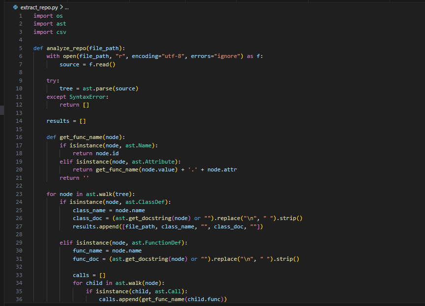
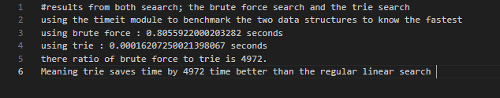
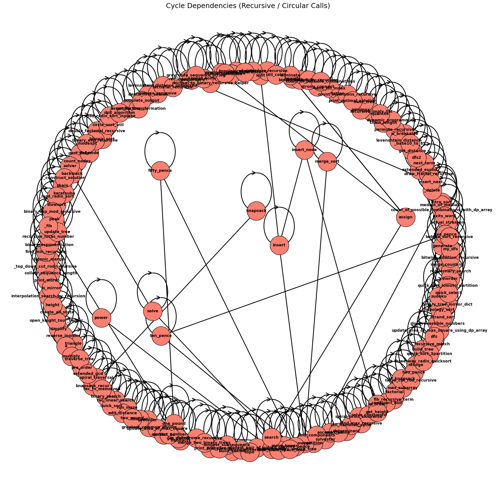
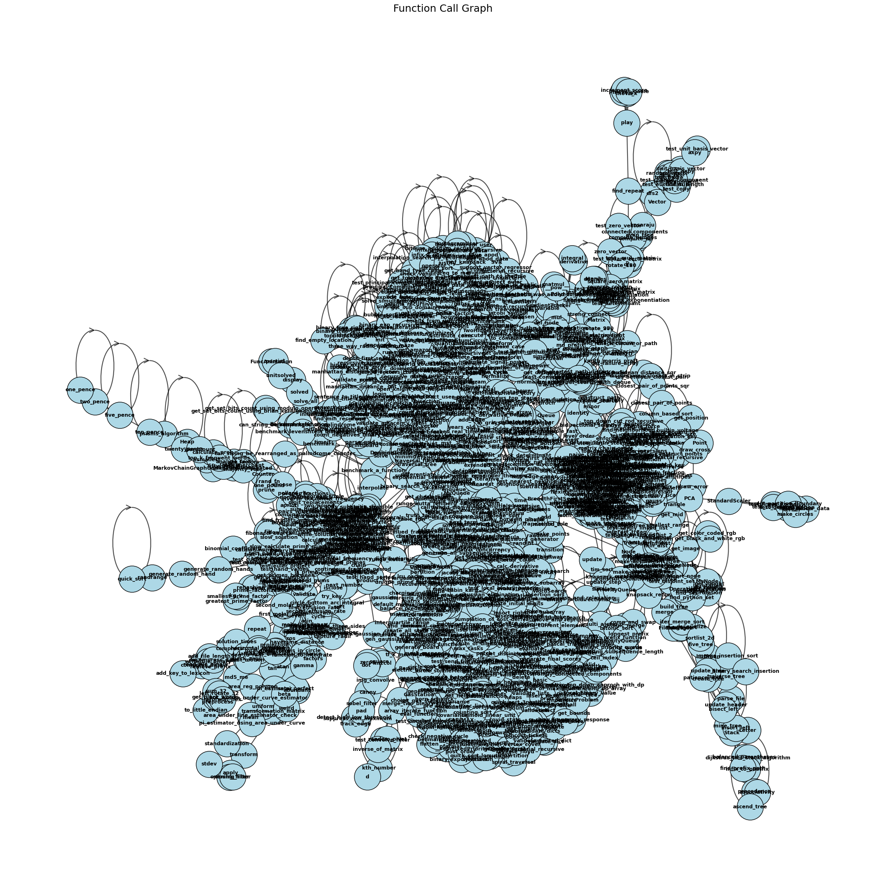
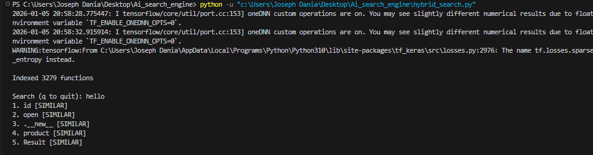
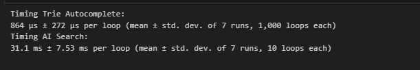
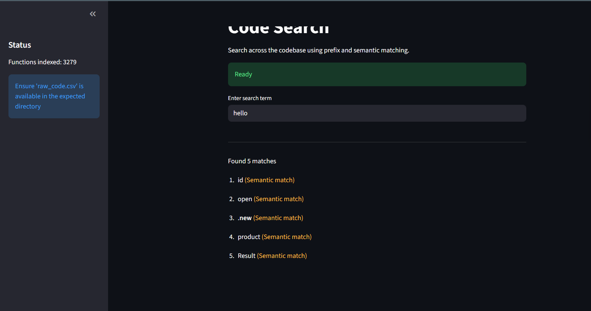
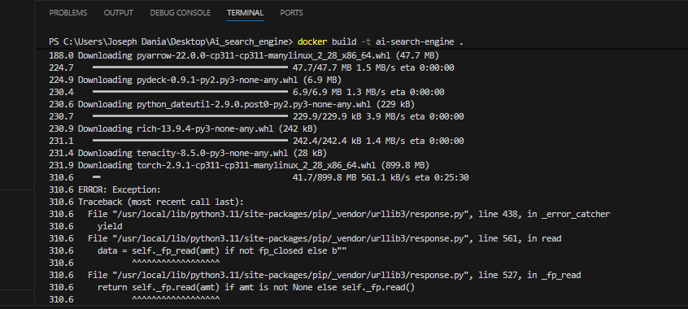

# Ai_search_engine
Working with DSA and AI
This project covers the application of DSA (Data Structures and Algorithms) and AI using extracted functions from a python repo.
Using AST (Abstract Syntax Tree) to extract all the functions, docstrings and function calls from every python file in the folder.

After collecting and cleaning the data, I applied trie and used DFS to traverse the functions to create autocomplete, insert and search for functions.

I showed difference between brute force search and depth first search.

I implemented cycle detection to determine recursive functions.

I implemented AI semantic search using sentence transformers and faiss to vectorize the functions and make the semantic search easy.
I saved the indexing in a different file for easy access.

I implemented a hybrid search, the search takes a word and brings the result of the trie and the semantic search.

From the hybrid search i benchmarked the results to see the time difference.

I use streamlit to create a beautiful interface for the hybrid search.

Finally, i wrote a dockerfile to contain the app, had issues with this part but it finally worked.

This project is an eye opener to me it has exposed me to a larger part of python programming and working with algorithms.
it has made me see the need to go deeper into algorithms and problem solving.
